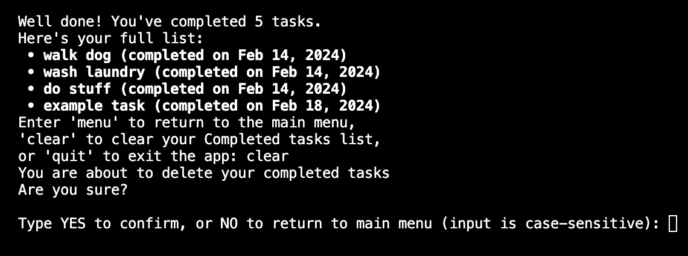
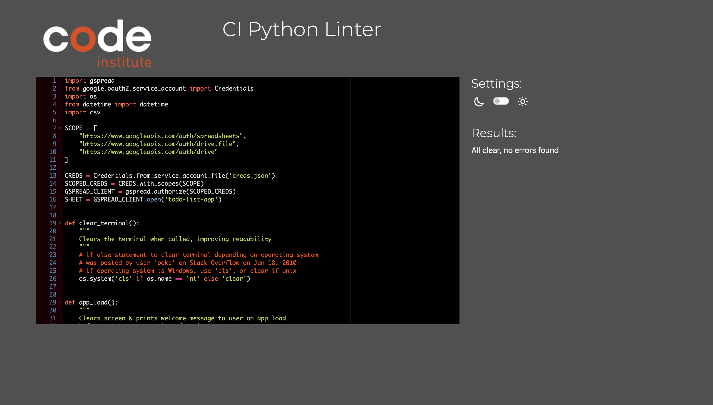

**Table of contents:**

- [Introduction](#introduction)
- [Deployed Site](#deployed-site)
- [User Experience](#user-experience)
  - [Workflow Logic Charts](#workflow-logic-charts)
  - [User Goals](#user-goals)
  - [User Stories](#user-stories)
  - [Site Owner's Goals](#site-owners-goals)
- [Features](#features)
  - [Main Menu](#main-menu)
  - [Creating a Task](#creating-a-task)
  - [Marking Tasks as Done](#marking-tasks-as-done)
  - [Deleting a Task](#deleting_a_task)
  - [Completed Tasks List](#completed-tasks-list)
  - [Data Model](#data-model)
- [Testing and Validation](#testing-and-validation)
  - [Testing Methodology](#testing-methodology)
  - [Pep-8 Code Analysis](#pep-8-code-analysis)
  - [Development](#development)
  - [Contributing](#contributing)
  - [Deployment](#deployment)
  - [Further Development and Future Features](#further-development-and-future-features)
- [Technologies Used](#technologies-used)
- [Acknowledgements](#acknowledgements)

## Introduction

To Do List is a CLI application written in Python that allows a user to record and store their To Do tasks, mark tasks as complete, and see when they created or completed tasks.

## Deployed Site

The program has been deployed to Heroku and can be accessed [here](https://pp3todoapp-ab2e466bceb0.herokuapp.com/).

## User Experience

### Workflow Logic Charts

Draft Application Logic flowchart

A number of changes were made to the original logic shown in the above flowchart, created during the project's inception.

These deviations from the original flow chart were made to simplify the code and improve the user experience, limiting their options to the most useful and necessary.

#### Create new list

Due to constraints relating to the use of Google Sheets as a method of persistent storage, it was decided that the application will access a single spreadsheet, consisting of two worksheets, 'Tasks' and 'Done'.

As a result of this decision, the user is presented with both their Tasks list and the main menu when running the app, and the 'View list' option was consolidated into the main options menu.

#### Exiting the application

In the original spec, the user would only be able to exit the application from the 'View list' option.

In the current version, the user is given the option to quit the app from the main menu, as well as the completed tasks section.

This ensures that the user has multiple points at which they can exit the app. A particularly simple example of this logic allows the user to run the app, view their tasks to complete, and quit the app with as little friction as possible.

### User Goals

- I would like to store To Do list data, check off tasks when I complete them, and view and delete a list of completed tasks
- I would like the app to record the date that I create and complete tasks, for later reference
- I would like the app to display my To Do list in a user-friendly, readable format
- I would like the data to be persistent, saving to a database so I can view it later, even after closing the program

### User Stories

- The app should be intuitive, and display actionable and informative data
- The app should be responsive to my input, and inform me if I make any mistakes or input any invalid data
- The app should store my data, and use persistent storage to allow me to view it at a later date after closing the app
- The app should clear the terminal display appropriately after certain actions, such as when I delete data, clear a list, or exit the program

### Site Owner's Goals

- I aim to create a useful program through which data can be stored with relevant contextual information, such as dates and priorities/importance
- I aim to create a program which a user can quit, and come back to at a later date
- I aim to implement defensive design in the program so that exceptions and errors are caught and handled well, with as little inconvenience to the user as possible

## Features

### Main menu

Upon running the application, the user is presented with their To Do list and the main menu. If the To Do list is empty, a message telling the user that they have no tasks to complete is displayed.

The menu consists of five options. Four of these are accessible by entering a number from 1 - 4, while the fifth (exiting the application) is triggered by entering the word `exit`. This prompt was chosen in favour over a numerical command in order to prevent accidental exits, to improve the user experience.

### Creating a Task

From the main menu, entering `1` calls the create_task function, and the user is asked to enter their new task.

There are a handful of keywords (stored in the important_keywords) variable that the user is forbidden from entering as a task name:

`important_keywords = ['quit', 'menu', 'clear', 'yes', 'no']`

These keywords have been reserved for prompts that are used elsewhere in the application. It is important that these words are not used as Task names as the creation of such tasks results in list items that cannot be marked as completed or removed from the To Do list.

Once a new task is created, the updated To Do list is printed to the terminal along with the main menu options.

### Marking Tasks as Done

To mark a task as Done, the user is asked to enter the index number of their completed task or the task name.

If they enter an invalid index or task name, they are informed that their entered task cannot be found, and are prompted to try again.

Once a valid index number or task name has been received, the task is removed from the To Do list and moved to the list of completed tasks, with a record of the date that the task was marked as complete.

### Deleting a Task

It is also possible to delete a task by entering `3` from the main menu. This option differs from marking a task as complete as it removes the task and all data related to it, in contrast to marking a task as done which preserves the title and moves it to the completed task list.

The user is prompted to enter a task's index number or its title.

A confirmation prompt is then displayed, asking the user to confirm by entering `YES` or `NO`. This prompt is case-sensitive to prevent the accidental deletion of unrecoverable data.

Once deleted, app_load() is called and the updated Task list is displayed along with the main menu.

### Completed Tasks List

By entering `4` from the options menu, the user can view a log of their completed tasks along with the dates that they marked these tasks as complete.

Three options are presented: `menu`, which takes the user back to the options menu, `clear`, to delete all data from this list, and `quit`, which calls the built-in Python `exit()` function and quits the app.

When `clear` is chosen, the user is asked to confirm their choice. This Yes/No option is case-sensitive to defend against the possibility of accidental deletion of unrecoverable data.

Once cleared, all data is removed from the 'Done' worksheet and the user is taken back to the main menu.

### Data Model

#### Tasks Worksheet

The core of the application revolves around managing tasks. These tasks are stored in a worksheet named "Tasks" within a Google Sheets document. Each task is represented as a row in the worksheet, with the following structure:

1. **Task Name**: The description of the task entered by the user.
2. **Date Created**: The date when the task was created. This field is automatically populated with the current date when a new task is added.

#### Done Worksheet

Tasks that have been completed are moved from the "Tasks" worksheet to the "Done" worksheet. This allows users to track their completed tasks separately. The "Done" worksheet has the same structure as the "Tasks" worksheet:

1. **Task Name**: The description of the completed task.
2. **Date Completed**: The date when the task was marked as completed. Similar to the "Date Created" field, this is automatically populated when a task is moved to the "Done" list.

## Testing and Validation

### Testing Methodology

#### Pep-8 Code Analysis

Code has been passed through the [Code Institute Pep8 Linter](https://pep8ci.herokuapp.com/) and returns with no issues.

Pep8 Linter Results

 

## Development and Deployment

### Development

### Contributing

### Deployment

### Further Development and Future Features

## Technologies Used

- [Visual Studio Code](https://code.visualstudio.com/): Code editing
- [GitHub](https://github.com/): Source control
- [Heroku](https://www.heroku.com): Live deployment of the app
- [Code Institute PEP8 Linter](https://pep8ci.herokuapp.com/): Python code analysis tool
- [datetime Python module](https://docs.python.org/3/library/datetime.html): used to input date data into the spreadsheet
- [Google Sheets](https://www.google.com/sheets/about/): Cloud-based spreadsheet editor used to store data
- [gspread API](https://docs.gspread.org/en/latest/): Python API for Google Sheets, used to access spreadsheets, provide access to run.py, and read, write and format cells
- [Google Drive API](https://developers.google.com/drive/api/guides/about-sdk): REST API, credentials, and authorisation

## Acknowledgements

Date formatting using `strftime()` method adapted from an example posted by [NPE](https://stackoverflow.com/users/367273/npe) in [this](https://stackoverflow.com/questions/6288892/python-how-to-convert-datetime-format) Stack Overflow thread.

ANSI character methods to print bold text in the terminal adapted from examples posted by [Peter Mortensen](https://stackoverflow.com/users/63550/peter-mortensen) and [Bacara](https://stackoverflow.com/users/1770999/bacara) in [this](https://stackoverflow.com/questions/8924173/how-can-i-print-bold-text-in-python#:~:text=In%20Python%2C%20escape%20sequences%20are,want%20to%20represent%20in%20bold.) Stack Overflow thread.

[This](https://patorjk.com/software/taag) text to ASCII art generator by Patrick Gillespie on [patrorjk.com](https://patorjk.com/) was used to generate the ASCII art displayed on app load.

Course content from Code Institute's Diploma in Full Stack Software Development has been useful in teaching programming concepts and Python methods.

Guidance from Code Institute mentor Brian O'Hare has been invaluable throughout the stages of this project's inception and development.
